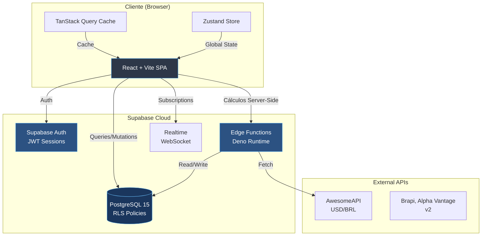
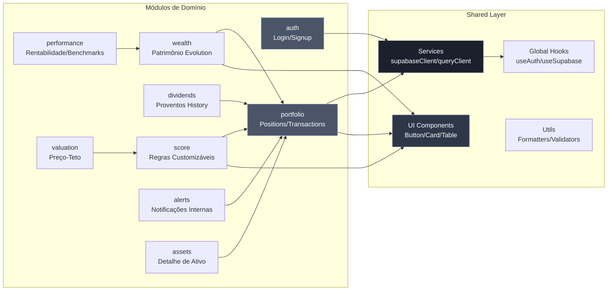
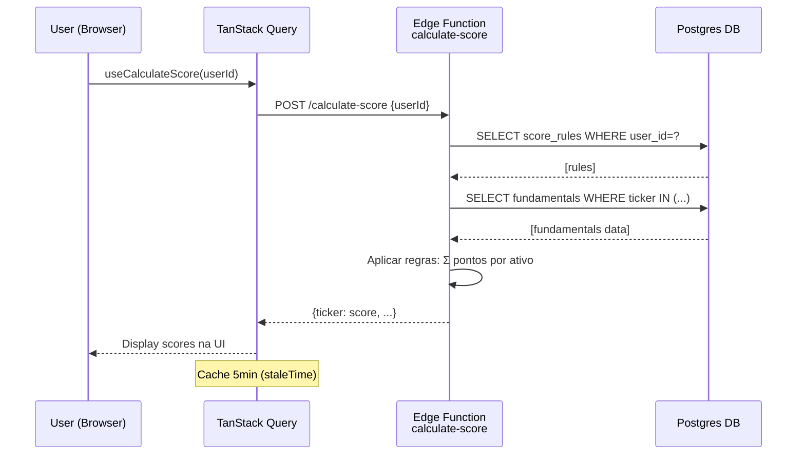

# Architecture Spine - Valora MVP

## Paradigma

**Monolito modular** com módulos como pastas organizacionais. Separação clara de código por domínio (auth, portfolio, score, valuation, alerts) sem boundaries rígidas entre módulos. Pragmático para MVP: permite importação livre entre módulos, deploy único, velocidade de desenvolvimento. Preparado para extração futura de microserviços (v2+) quando necessário.

## Architecture Decisions (ADs)

### AD-1: Monolito Modular com Módulos Organizacionais
**Binds:** Estrutura de pastas `src/modules/{domain}/` com components, hooks, services, types. Um build Vite, um deploy. Módulos podem importar uns aos outros livremente.  
**Prevents:** Complexidade prematura de microserviços, overhead de comunicação entre serviços, múltiplos deploys no MVP.  
**Rule:** Cada módulo vive em `src/modules/{nome}/` e contém sua lógica completa. `src/shared/` para código cross-cutting (UI primitives, utils, types globais). Nenhum enforcement técnico de boundaries — confiança em convenção de código.  
**Status:** ADOPTED

### AD-2: Zustand para State Management
**Binds:** Zustand como store global. Slices separadas por domínio (auth, portfolio, preferences). API minimalista sem boilerplate de actions/reducers.  
**Prevents:** Overhead de Redux (actions, reducers, middleware) inadequado para complexidade MVP. Prop-drilling excessivo de Context API para estados globais frequentes.  
**Rule:** Criar stores em `src/modules/{domain}/store.ts`. Usar `create()` direto, sem middleware no MVP. Persist opcional via `persist` middleware para preferências de usuário.  
**Status:** ADOPTED

### AD-3: TanStack Query + Supabase Client para Data Fetching
**Binds:** TanStack Query (React Query) v5 para queries e mutations. Supabase Client JS para todas as chamadas ao backend. Cache automático, estados de loading/error, invalidação declarativa.  
**Prevents:** Fetch manual com useState/useEffect repetitivo. Cache inconsistente. Loading states duplicados.  
**Rule:** Todo acesso a dados via hooks `useQuery` / `useMutation` do TanStack Query. Services de módulo (`src/modules/{domain}/services/`) encapsulam chamadas Supabase. Query keys estruturadas: `['domain', 'resource', ...params]` (ex: `['portfolio', 'positions', userId]`).  
**Status:** ADOPTED

### AD-4: Supabase Realtime Seletivo (Não Default)
**Binds:** Realtime subscriptions apenas para casos de alta prioridade UX: novos alertas (`alerts` table), updates críticos de posições compartilhadas (futuro multi-user).  
**Prevents:** Overhead de WebSocket connections desnecessário. Complexidade de sincronização bidirecional quando polling/refetch suficiente.  
**Rule:** Usar Supabase `.on('postgres_changes')` apenas quando: (1) dado muda fora da sessão do usuário, (2) latência de polling inaceitável (>10s), (3) UX requer feedback instantâneo. Para dados modificados pelo próprio usuário: invalidar query cache via `queryClient.invalidateQueries()` após mutation — não usar Realtime.  
**Status:** ADOPTED

### AD-5: Cálculos Híbridos Cliente-Servidor
**Binds:**  
- **Client-side (apresentacional):** Soma de patrimônio, ordenação de tabelas, filtros de UI, agrupamento por classe de ativo, cálculos de % de peso relativo.  
- **Server-side (lógica de negócio):** Score Fundamentalista, Preço-Teto (Bazin), preço médio ponderado de transações → posições, geração de alertas, validações complexas.  

**Prevents:** Servidor sobrecarregado com cálculos triviais. Cliente executando lógica de negócio inconsistente ou vulnerável a manipulação.  
**Rule:** Se cálculo é derivado de dados já no cliente e não afeta estado persistido ou regras de negócio → cliente. Se cálculo determina estado persistido, alertas, scores, ou tem complexidade que justifica centralização → servidor (Supabase Edge Functions ou Postgres Functions).  
**Status:** ADOPTED

### AD-6: RLS Strategy — Privado vs Público
**Binds:**  
- **Tabelas privadas (RLS ativo):** `users`, `positions`, `transactions`, `score_rules`, `alerts`, `user_preferences`. Policy: `user_id = auth.uid()`.  
- **Tabelas públicas (sem RLS):** `assets`, `price_history`, `dividends`, `fundamentals`, `benchmarks`. Dados de mercado compartilhados, inseridos via service role, leitura livre para usuários autenticados.  

**Prevents:** RLS em tabelas públicas degradando performance desnecessariamente. Dados privados expostos por falta de RLS.  
**Rule:** Tabela contém dado de usuário específico → RLS obrigatório. Tabela contém dado de mercado/seed compartilhado → sem RLS, acesso via `anon` ou `authenticated` role com SELECT apenas.  
**Status:** ADOPTED

### AD-7: Estrutura Frontend — Módulos Autocontidos
**Binds:** Estrutura:
```
src/
├── modules/
│   ├── auth/           (login, signup, password recovery)
│   ├── portfolio/      (positions, transactions, CSV import)
│   ├── wealth/         (patrimônio, evolução, composição)
│   ├── dividends/      (proventos histórico)
│   ├── performance/    (rentabilidade, benchmarks)
│   ├── score/          (Score Fundamentalista customizável)
│   ├── valuation/      (Preço-Teto, estratégias)
│   ├── alerts/         (lista de alertas, geração)
│   ├── assets/         (detalhe de ativo, busca)
│   └── preferences/    (configurações usuário - futuro)
├── shared/
│   ├── components/     (Button, Card, Table, Modal, Tooltip)
│   ├── hooks/          (useAuth, useSupabase, useToast)
│   ├── services/       (supabaseClient, queryClient)
│   ├── types/          (Database types, domain DTOs)
│   └── utils/          (formatters, validators, calculators client-side)
├── App.tsx
├── main.tsx
└── routes.tsx
```
Cada `modules/{domain}/` contém:
- `components/` — React components do módulo
- `hooks/` — custom hooks (ex: `usePositions()`, `useScore()`)
- `services/` — chamadas Supabase encapsuladas
- `types/` — tipos específicos do módulo

**Prevents:** Mistura de concerns em pastas flat. Dificuldade de navegar código por feature. Código compartilhado poluindo módulos.  
**Rule:** Código usado por um único domínio → `src/modules/{domain}/`. Código usado por 2+ módulos → `src/shared/`. Primitive UI components sempre `shared/components/`.  
**Status:** ADOPTED

### AD-8: Posições Independentes + Transações Opcionais
**Binds:** `positions` tabela independente — usuário pode cadastrar posição diretamente (ticker, quantidade, preço médio, data). `transactions` tabela opcional — quando existe, recalcula preço médio ponderado e quantidade líquida da posição correspondente via trigger Postgres ou Edge Function.  
**Prevents:** Obrigar cadastro de transações detalhadas no onboarding (fricção UX). Perder rastreabilidade quando usuário tem histórico detalhado.  
**Rule:** Posição pode existir sem transações (alerta "Posição sem transações cadastradas" gerado). Quando transações existem para um ticker+user, preço médio e quantidade líquida são recalculados automaticamente. Trigger Postgres ou job manual no MVP.  
**Status:** ADOPTED

### AD-9: Score e Preço-Teto — Cálculo On-Demand sem Persistência de Resultado
**Binds:** Score Fundamentalista e Preço-Teto calculados on-demand quando usuário acessa tela. Regras de score (`score_rules` table) persistidas. Resultado de score e teto **não** persistidos — calculados a cada request.  
**Prevents:** Complexidade de invalidação de cache de cálculos quando dados fundamentalistas mudam. Overhead de armazenamento de resultados derivados no MVP com dados seed estáticos.  
**Rule:** `score_rules` persistida (user-specific). Cálculo de score via Postgres Function ou Edge Function que lê `fundamentals` + `score_rules` e retorna resultado. Cache opcional no TanStack Query (ex: staleTime 5 min). Quando dados fundamentalistas forem dinâmicos (v2+), adicionar cache explícito ou materialização.  
**Status:** ADOPTED

### AD-10: Deploy — Railway/Render + Supabase Cloud
**Binds:** Frontend (Vite build) + eventual backend Node/workers em Railway ou Render. Supabase Cloud para database Postgres, Auth, Edge Functions, Realtime. CI/CD via GitHub Actions. Ambientes: `production` (main branch) + `staging` (feature branches preview).  
**Prevents:** Vendor lock-in total em plataforma única. Necessidade de Vercel Pro para features enterprise no MVP.  
**Rule:** Vite build deployado como SPA. Variáveis de ambiente: `VITE_SUPABASE_URL`, `VITE_SUPABASE_ANON_KEY` (públicas). Service role key (`SUPABASE_SERVICE_ROLE_KEY`) apenas em backend Node se necessário (jobs, validações server-side). Supabase projetos separados para prod/staging.  
**Status:** ADOPTED

### AD-11: Performance Strategy
**Binds:** Targets NFR do PRD: Carteira <2s (p95), Gráficos <3s, Score <1s. Técnicas: Postgres indexes em `(user_id, ticker, created_at)`, queries limitadas a 50 posições no MVP, lazy-load de gráficos com `React.lazy()`, TanStack Query `staleTime` 5min para dados low-churn (fundamentals, dividends).  
**Prevents:** Queries full-table sem index, carregamento síncrono de todos os módulos, refetch desnecessário de dados estáticos.  
**Rule:** Index em toda FK e coluna de filtro comum (user_id, ticker, date). Componentes pesados (charts) lazy-loaded. Query `staleTime` proporcional à frequência de mudança dos dados (cotações: 1min, fundamentals: 5min, seed: 1h).  
**Status:** ADOPTED

### AD-12: AwesomeAPI Integration (Cotação USD)
**Binds:** Client-side fetch de `https://economia.awesomeapi.com.br/json/last/USD-BRL` via TanStack Query. `staleTime` 1h (taxa muda devagar). Fallback para taxa fixa R$5,00 se API falhar ou timeout >2s.  
**Prevents:** Server-side cache desnecessário no MVP (overhead de manutenção). Falha total de cálculo de patrimônio internacional se API cair.  
**Rule:** Hook `useUSDRate()` encapsula fetch + fallback. Armazenar última taxa bem-sucedida em localStorage como fallback secundário. Exibir badge "taxa USD aproximada" quando usar fallback.  
**Status:** ADOPTED

### AD-13: Local Dev Setup
**Binds:** Supabase Cloud projeto `dev` separado de `production`. Vite dev server local (`npm run dev`). `.env.local` com `VITE_SUPABASE_URL` e `VITE_SUPABASE_ANON_KEY` do projeto dev. Seed scripts SQL (`supabase/seed.sql`) para popular dados mock localmente via Supabase Studio ou CLI.  
**Prevents:** Desenvolvedores modificando dados de produção. Setup complexo com Docker/Supabase local desnecessário no MVP.  
**Rule:** `README.md` documenta: (1) criar projeto Supabase dev, (2) rodar migrations, (3) popular seed, (4) copiar keys para `.env.local`. Docker opcional, não obrigatório. CLI Supabase para migrations (`supabase db push`).  
**Status:** ADOPTED

### AD-14: Alertas On-Demand (MVP)
**Binds:** Botão "Atualizar Alertas" na tela `/alertas` dispara Supabase Edge Function `POST /functions/v1/generate-alerts`. Function varre `positions` e `transactions` do `user_id`, detecta inconsistências (posição sem transação, dividendo esperado >95 dias), insere/atualiza tabela `alerts`. Cliente invalida query `['alerts', userId]` após success → refetch automático.  
**Prevents:** Execução automática cara/desnecessária no MVP. Alertas desatualizados sem mecanismo de refresh.  
**Rule:** Edge Function protegida por auth (só gera alertas do próprio user). Job idempotente (não duplica alertas existentes com mesmo tipo+ticker). v2: migrar para cron diário às 6h via `pg_cron` ou agendamento Supabase.  
**Status:** ADOPTED

## Stack Técnica (Seed)

**Frontend:**
- **Runtime:** Vite 5.x (build tool + dev server)
- **Framework:** React 18.3.x
- **Linguagem:** TypeScript 5.5.x
- **State Management:** Zustand 4.5.x
- **Data Fetching:** TanStack Query (React Query) 5.x
- **Routing:** React Router 6.x
- **UI Styling:** TailwindCSS 3.4.x (tema dark-only no MVP)
- **Charts:** Recharts 2.12.x (patrimônio, dividendos, rentabilidade)
- **Forms:** React Hook Form 7.x + Zod validation
- **Date Handling:** date-fns 3.x

**Backend:**
- **BaaS:** Supabase (Postgres 15, Auth, Edge Functions Deno, Realtime, Storage)
- **Client SDK:** @supabase/supabase-js 2.45.x
- **Auth:** Supabase Auth (JWT, email/password, password recovery)
- **Database:** PostgreSQL 15 via Supabase
- **Functions:** Supabase Edge Functions (Deno runtime) para cálculos server-side, jobs, validações

**Dados Externos (MVP):**
- **Cotação USD:** AwesomeAPI (`https://economia.awesomeapi.com.br/json/last/USD-BRL`) — gratuita, sem auth
- **Cotações BR/Fundamentals:** Dados seed/mock (50 ativos) — v2 integra Brapi, Alpha Vantage

**Deploy:**
- **Frontend:** Railway ou Render (SPA estático Vite build)
- **Backend/Jobs:** Railway ou Render para eventual backend Node, ou Supabase Edge Functions agendadas
- **Database:** Supabase Cloud (Postgres managed)
- **CI/CD:** GitHub Actions (lint, type-check, build, deploy on push)

**Tooling:**
- **Package Manager:** pnpm 9.x (performance + disk efficiency)
- **Linting:** ESLint 9.x + Prettier
- **Testing:** Vitest (unit) + Playwright (E2E) — básico no MVP

## Estrutura de Módulos

```
valora/
├── src/
│   ├── modules/
│   │   ├── auth/
│   │   │   ├── components/
│   │   │   │   ├── LoginForm.tsx
│   │   │   │   ├── SignupForm.tsx
│   │   │   │   └── PasswordRecoveryForm.tsx
│   │   │   ├── hooks/
│   │   │   │   └── useAuth.ts
│   │   │   ├── services/
│   │   │   │   └── authService.ts
│   │   │   └── types/
│   │   │       └── auth.types.ts
│   │   │
│   │   ├── portfolio/
│   │   │   ├── components/
│   │   │   │   ├── PositionList.tsx
│   │   │   │   ├── AddPositionModal.tsx
│   │   │   │   ├── TransactionImportCSV.tsx
│   │   │   │   └── PortfolioComposition.tsx
│   │   │   ├── hooks/
│   │   │   │   ├── usePositions.ts
│   │   │   │   ├── useTransactions.ts
│   │   │   │   └── useImportCSV.ts
│   │   │   ├── services/
│   │   │   │   ├── positionsService.ts
│   │   │   │   └── transactionsService.ts
│   │   │   └── types/
│   │   │       └── portfolio.types.ts
│   │   │
│   │   ├── wealth/
│   │   │   ├── components/
│   │   │   │   ├── WealthEvolutionChart.tsx
│   │   │   │   ├── CompositionPieChart.tsx
│   │   │   │   └── InternationalExposureCard.tsx
│   │   │   ├── hooks/
│   │   │   │   └── useWealthHistory.ts
│   │   │   └── services/
│   │   │       └── wealthService.ts
│   │   │
│   │   ├── dividends/
│   │   │   ├── components/
│   │   │   │   ├── DividendsTimeline.tsx
│   │   │   │   └── DividendsByAssetTable.tsx
│   │   │   ├── hooks/
│   │   │   │   └── useDividends.ts
│   │   │   └── services/
│   │   │       └── dividendsService.ts
│   │   │
│   │   ├── performance/
│   │   │   ├── components/
│   │   │   │   ├── PerformanceChart.tsx
│   │   │   │   ├── BenchmarkComparison.tsx
│   │   │   │   └── PerformanceByAssetTable.tsx
│   │   │   ├── hooks/
│   │   │   │   ├── usePerformance.ts
│   │   │   │   └── useBenchmarks.ts
│   │   │   └── services/
│   │   │       └── performanceService.ts
│   │   │
│   │   ├── score/
│   │   │   ├── components/
│   │   │   │   ├── ScoreRuleBuilder.tsx
│   │   │   │   ├── ScoreRuleList.tsx
│   │   │   │   └── ScoreDisplay.tsx
│   │   │   ├── hooks/
│   │   │   │   ├── useScoreRules.ts
│   │   │   │   └── useCalculateScore.ts
│   │   │   ├── services/
│   │   │   │   └── scoreService.ts
│   │   │   └── types/
│   │   │       └── score.types.ts
│   │   │
│   │   ├── valuation/
│   │   │   ├── components/
│   │   │   │   ├── FairPriceTable.tsx
│   │   │   │   ├── BazinCalculator.tsx
│   │   │   │   └── ValuationMethodSelector.tsx
│   │   │   ├── hooks/
│   │   │   │   └── useFairPrice.ts
│   │   │   └── services/
│   │   │       └── valuationService.ts
│   │   │
│   │   ├── alerts/
│   │   │   ├── components/
│   │   │   │   ├── AlertList.tsx
│   │   │   │   ├── AlertBadge.tsx
│   │   │   │   └── AlertItem.tsx
│   │   │   ├── hooks/
│   │   │   │   └── useAlerts.ts
│   │   │   └── services/
│   │   │       └── alertsService.ts
│   │   │
│   │   └── assets/
│   │       ├── components/
│   │       │   ├── AssetDetail.tsx
│   │       │   ├── AssetPriceChart.tsx
│   │       │   ├── AssetFundamentals.tsx
│   │       │   └── AssetDividendHistory.tsx
│   │       ├── hooks/
│   │       │   └── useAsset.ts
│   │       └── services/
│   │           └── assetsService.ts
│   │
│   ├── shared/
│   │   ├── components/
│   │   │   ├── Button.tsx
│   │   │   ├── Card.tsx
│   │   │   ├── Table.tsx
│   │   │   ├── Modal.tsx
│   │   │   ├── Tooltip.tsx
│   │   │   ├── Sidebar.tsx
│   │   │   ├── Badge.tsx
│   │   │   └── Spinner.tsx
│   │   ├── hooks/
│   │   │   ├── useSupabase.ts
│   │   │   ├── useToast.ts
│   │   │   └── useDebounce.ts
│   │   ├── services/
│   │   │   ├── supabaseClient.ts
│   │   │   └── queryClient.ts
│   │   ├── types/
│   │   │   ├── database.types.ts (gerado via Supabase CLI)
│   │   │   └── common.types.ts
│   │   └── utils/
│   │       ├── formatters.ts (currency, date, percentage)
│   │       ├── validators.ts (ticker, CSV format)
│   │       └── calculators.ts (client-side calcs)
│   │
│   ├── App.tsx
│   ├── main.tsx
│   ├── routes.tsx
│   └── index.css (Tailwind imports)
│
├── supabase/
│   ├── migrations/         (SQL migrations)
│   ├── functions/          (Edge Functions)
│   │   ├── calculate-score/
│   │   ├── calculate-fair-price/
│   │   └── generate-alerts/
│   └── seed.sql            (dados seed 50 ativos)
│
├── public/
├── .github/
│   └── workflows/
│       └── ci-cd.yml
├── package.json
├── tsconfig.json
├── vite.config.ts
├── tailwind.config.ts
└── README.md
```

## Database Schema (Seed)

### Tabelas Privadas (com RLS)

#### `users`
Estende `auth.users` com dados de perfil.
```sql
CREATE TABLE users (
  id UUID PRIMARY KEY REFERENCES auth.users(id) ON DELETE CASCADE,
  email TEXT NOT NULL UNIQUE,
  full_name TEXT NOT NULL,
  phone TEXT,
  created_at TIMESTAMPTZ DEFAULT NOW(),
  updated_at TIMESTAMPTZ DEFAULT NOW()
);

ALTER TABLE users ENABLE ROW LEVEL SECURITY;
CREATE POLICY "Users can view own profile" ON users FOR SELECT USING (auth.uid() = id);
CREATE POLICY "Users can update own profile" ON users FOR UPDATE USING (auth.uid() = id);
```

#### `positions`
Posições detidas pelo usuário (independente de transações).
```sql
CREATE TABLE positions (
  id UUID PRIMARY KEY DEFAULT gen_random_uuid(),
  user_id UUID NOT NULL REFERENCES users(id) ON DELETE CASCADE,
  ticker TEXT NOT NULL,
  quantity NUMERIC(18, 8) NOT NULL CHECK (quantity >= 0),
  average_price NUMERIC(18, 4) NOT NULL CHECK (average_price >= 0),
  acquisition_date DATE NOT NULL,
  created_at TIMESTAMPTZ DEFAULT NOW(),
  updated_at TIMESTAMPTZ DEFAULT NOW(),
  UNIQUE (user_id, ticker)
);

CREATE INDEX idx_positions_user_ticker ON positions(user_id, ticker);

ALTER TABLE positions ENABLE ROW LEVEL SECURITY;
CREATE POLICY "Users can CRUD own positions" ON positions FOR ALL USING (auth.uid() = user_id);
```

#### `transactions`
Histórico de compras, vendas, dividendos.
```sql
CREATE TYPE transaction_type AS ENUM ('buy', 'sell', 'dividend', 'jcp', 'bonus');

CREATE TABLE transactions (
  id UUID PRIMARY KEY DEFAULT gen_random_uuid(),
  user_id UUID NOT NULL REFERENCES users(id) ON DELETE CASCADE,
  ticker TEXT NOT NULL,
  type transaction_type NOT NULL,
  quantity NUMERIC(18, 8) NOT NULL CHECK (quantity > 0),
  price NUMERIC(18, 4) NOT NULL CHECK (price >= 0),
  brokerage_fee NUMERIC(18, 4) DEFAULT 0,
  tax NUMERIC(18, 4) DEFAULT 0,
  transaction_date DATE NOT NULL,
  created_at TIMESTAMPTZ DEFAULT NOW()
);

CREATE INDEX idx_transactions_user_ticker ON transactions(user_id, ticker);
CREATE INDEX idx_transactions_date ON transactions(transaction_date DESC);

ALTER TABLE transactions ENABLE ROW LEVEL SECURITY;
CREATE POLICY "Users can CRUD own transactions" ON transactions FOR ALL USING (auth.uid() = user_id);
```

#### `score_rules`
Regras customizadas de Score Fundamentalista.
```sql
CREATE TYPE score_metric AS ENUM ('pl', 'pvp', 'roe', 'dy', 'debt_equity', 'net_margin');
CREATE TYPE score_operator AS ENUM ('lt', 'lte', 'gt', 'gte', 'between');

CREATE TABLE score_rules (
  id UUID PRIMARY KEY DEFAULT gen_random_uuid(),
  user_id UUID NOT NULL REFERENCES users(id) ON DELETE CASCADE,
  name TEXT NOT NULL,
  metric score_metric NOT NULL,
  operator score_operator NOT NULL,
  threshold_min NUMERIC(18, 4),
  threshold_max NUMERIC(18, 4),
  points INTEGER NOT NULL,
  created_at TIMESTAMPTZ DEFAULT NOW(),
  CHECK (
    (operator IN ('lt', 'lte', 'gt', 'gte') AND threshold_min IS NOT NULL AND threshold_max IS NULL)
    OR
    (operator = 'between' AND threshold_min IS NOT NULL AND threshold_max IS NOT NULL)
  )
);

CREATE INDEX idx_score_rules_user ON score_rules(user_id);

ALTER TABLE score_rules ENABLE ROW LEVEL SECURITY;
CREATE POLICY "Users can CRUD own score rules" ON score_rules FOR ALL USING (auth.uid() = user_id);
```

#### `alerts`
Alertas internos de inconsistências e oportunidades.
```sql
CREATE TYPE alert_type AS ENUM ('inconsistency', 'opportunity', 'event');
CREATE TYPE alert_status AS ENUM ('new', 'read', 'ignored');

CREATE TABLE alerts (
  id UUID PRIMARY KEY DEFAULT gen_random_uuid(),
  user_id UUID NOT NULL REFERENCES users(id) ON DELETE CASCADE,
  type alert_type NOT NULL,
  title TEXT NOT NULL,
  description TEXT,
  ticker TEXT,
  status alert_status DEFAULT 'new',
  created_at TIMESTAMPTZ DEFAULT NOW(),
  updated_at TIMESTAMPTZ DEFAULT NOW()
);

CREATE INDEX idx_alerts_user_status ON alerts(user_id, status);
CREATE INDEX idx_alerts_created ON alerts(created_at DESC);

ALTER TABLE alerts ENABLE ROW LEVEL SECURITY;
CREATE POLICY "Users can CRUD own alerts" ON alerts FOR ALL USING (auth.uid() = user_id);
```

#### `user_preferences`
Configurações de usuário (tema, método valuation padrão, etc.).
```sql
CREATE TABLE user_preferences (
  user_id UUID PRIMARY KEY REFERENCES users(id) ON DELETE CASCADE,
  default_score_rule_id UUID REFERENCES score_rules(id) ON DELETE SET NULL,
  valuation_method TEXT DEFAULT 'bazin',
  preferred_currency TEXT DEFAULT 'BRL',
  updated_at TIMESTAMPTZ DEFAULT NOW()
);

ALTER TABLE user_preferences ENABLE ROW LEVEL SECURITY;
CREATE POLICY "Users can CRUD own preferences" ON user_preferences FOR ALL USING (auth.uid() = user_id);
```

### Tabelas Públicas (sem RLS, leitura autenticada)

#### `assets`
Catálogo de ativos (seed 50 ativos representativos).
```sql
CREATE TYPE asset_type AS ENUM ('stock_br', 'fii', 'bdr', 'stock_us', 'reit', 'crypto');

CREATE TABLE assets (
  ticker TEXT PRIMARY KEY,
  name TEXT NOT NULL,
  type asset_type NOT NULL,
  currency TEXT NOT NULL DEFAULT 'BRL',
  created_at TIMESTAMPTZ DEFAULT NOW(),
  updated_at TIMESTAMPTZ DEFAULT NOW()
);

CREATE INDEX idx_assets_type ON assets(type);
-- Sem RLS — SELECT aberto para authenticated role
```

#### `price_history`
Histórico de preços diários (seed 12 meses).
```sql
CREATE TABLE price_history (
  id UUID PRIMARY KEY DEFAULT gen_random_uuid(),
  ticker TEXT NOT NULL REFERENCES assets(ticker) ON DELETE CASCADE,
  date DATE NOT NULL,
  open NUMERIC(18, 4),
  high NUMERIC(18, 4),
  low NUMERIC(18, 4),
  close NUMERIC(18, 4) NOT NULL,
  volume BIGINT,
  source TEXT DEFAULT 'seed',
  updated_at TIMESTAMPTZ DEFAULT NOW(),
  UNIQUE (ticker, date)
);

CREATE INDEX idx_price_history_ticker_date ON price_history(ticker, date DESC);
-- Sem RLS
```

#### `dividends`
Histórico de dividendos publicados (seed trimestral).
```sql
CREATE TABLE dividends (
  id UUID PRIMARY KEY DEFAULT gen_random_uuid(),
  ticker TEXT NOT NULL REFERENCES assets(ticker) ON DELETE CASCADE,
  ex_date DATE NOT NULL,
  payment_date DATE,
  value_per_share NUMERIC(18, 6) NOT NULL,
  type TEXT, -- 'dividend', 'jcp', 'interest'
  source TEXT DEFAULT 'seed',
  created_at TIMESTAMPTZ DEFAULT NOW(),
  UNIQUE (ticker, ex_date, type)
);

CREATE INDEX idx_dividends_ticker ON dividends(ticker);
-- Sem RLS
```

#### `fundamentals`
Indicadores fundamentalistas trimestrais (seed).
```sql
CREATE TABLE fundamentals (
  id UUID PRIMARY KEY DEFAULT gen_random_uuid(),
  ticker TEXT NOT NULL REFERENCES assets(ticker) ON DELETE CASCADE,
  reference_date DATE NOT NULL,
  pl NUMERIC(18, 4),
  pvp NUMERIC(18, 4),
  roe NUMERIC(18, 4),
  dy NUMERIC(18, 4),
  debt_equity NUMERIC(18, 4),
  net_margin NUMERIC(18, 4),
  lpa NUMERIC(18, 4), -- Lucro por ação
  vpa NUMERIC(18, 4), -- Valor patrimonial por ação
  source TEXT DEFAULT 'seed',
  updated_at TIMESTAMPTZ DEFAULT NOW(),
  UNIQUE (ticker, reference_date)
);

CREATE INDEX idx_fundamentals_ticker ON fundamentals(ticker);
-- Sem RLS
```

#### `benchmarks`
Histórico de benchmarks (CDI, IBOV, IFIX, S&P500) seed.
```sql
CREATE TABLE benchmarks (
  id UUID PRIMARY KEY DEFAULT gen_random_uuid(),
  name TEXT NOT NULL, -- 'CDI', 'IBOV', 'IFIX', 'S&P500'
  date DATE NOT NULL,
  value NUMERIC(18, 4) NOT NULL,
  source TEXT DEFAULT 'seed',
  UNIQUE (name, date)
);

CREATE INDEX idx_benchmarks_name_date ON benchmarks(name, date DESC);
-- Sem RLS
```

## Diagramas

### Arquitetura Geral



### Módulos Frontend



### Fluxo de Dados — Cálculo de Score



## Cálculos Server vs Client

### Client-Side (Apresentacional)

Executados em React components/hooks, usando dados já em cache do TanStack Query:

- **Soma de patrimônio total:** `Σ (cotação × quantidade)` de todas as posições.
- **Peso relativo de posições:** `(valor posição / patrimônio total) × 100`.
- **Agrupamento por classe de ativo:** filtrar posições por `asset.type` e somar valores.
- **Exposição internacional %:** `Σ (BDR + stocks US + REITs + crypto) / patrimônio total`.
- **Ordenação e filtros de UI:** sort por ticker, valor, variação %; filtros por tipo.
- **Ganho de capital %:** `((cotação atual − preço médio) / preço médio) × 100`.
- **Formatação:** currency, dates, percentages via `utils/formatters.ts`.

**Justificativa:** Dados já carregados no cliente, cálculos triviais, não afetam estado persistido, performance aceitável para 50-100 ativos.

### Server-Side (Lógica de Negócio)

Executados em Supabase Edge Functions ou Postgres Functions:

- **Score Fundamentalista:** Aplicar regras customizadas (`score_rules`) sobre indicadores (`fundamentals`). Complexidade: múltiplas regras × múltiplos ativos. Consistência crítica.
- **Preço-Teto Bazin:** `Dividendo anual por ação / DY mínimo`. Requer agregação de dividendos históricos, cálculo de média anual.
- **Preço médio ponderado (transactions → positions):** `Σ (preço × quantidade comprada) / Σ quantidade`. Trigger Postgres ou job batch quando transações importadas.
- **Geração de alertas:** Varrer posições sem transações, dividendos esperados não recebidos, ativos com cotação desatualizada. Lógica complexa, job agendado ou on-demand.
- **Validações de CSV import:** Parse, validação de tickers existentes, detecção de duplicatas. Edge Function recebe CSV, valida, retorna preview.

**Justificativa:** Lógica de negócio que define estado persistido (alertas, posições recalculadas), cálculos pesados ou que exigem consistência centralizada, preparação para escalar (cachear resultados server-side no futuro).

## Deferred

Decisões técnicas **não tomadas** no MVP — registrar para v2+:

1. **Plataforma de deploy definitiva:** Railway vs Render? Avaliar após MVP: custo, DX, suporte a Deno (se usar Edge Functions local), CI/CD integrado.
2. **Estratégia de cache para cálculos pesados:** Score e Preço-Teto calculados on-demand no MVP. Quando dados forem dinâmicos (v2 com APIs reais), avaliar: Redis cache, materialização de resultados em tabela `calculated_scores`, ou cache em TanStack Query com TTL longo.
3. **Logging e Observabilidade:** MVP usa `console.log` + Supabase logs básicos. v2: Sentry (erros frontend), Datadog/LogRocket (full-stack), structured logging em Edge Functions.
4. **Estratégia de testes:** MVP com testes mínimos (smoke tests Vitest). v2: coverage >70%, testes E2E Playwright para jornadas críticas (UJ-1 a UJ-4), integration tests com Supabase local.
5. **Migrations vs Seed data:** MVP usa `seed.sql` para popular assets/price_history/dividends. v2: separar seeds de produção (assets reais via API) de seeds de dev/test.
6. **Preço-Teto Graham e Múltiplos:** Apenas Bazin no MVP (AD-9). Fórmulas Graham/Múltiplos bem documentadas, implementação direta mas deferred para simplificar MVP.
7. **Multi-tenancy e billing:** MVP single-tenant (cada usuário suas posições privadas). v2 B2B requer multi-tenant (organizations), planos, usage metering.

## Open Questions

Questões do PRD §9 ainda sem resposta técnica definitiva:

1. **Qual API de cotação externa usar em v2?**  
   - **Candidatas:** Brapi (gratuita, BR), Alpha Vantage (grátis limitado, US), Yahoo Finance (scraping instável).  
   - **Critério decisão:** Custo (idealmente free tier para MVP early access), cobertura BR (ações + FIIs), estabilidade/SLA, facilidade de integração.  
   - **Impacto arquitetural:** Se API com rate limit agressivo → necessário job de cache noturno (Edge Function agendada) em vez de fetch on-demand.

2. **Como detectar "dividendo esperado não recebido" com dados seed?**  
   - **Proposta atual (PRD §9 Q2):** Se histórico mostra dividendo trimestral regular e passaram >95 dias desde último → gerar alerta.  
   - **Limitação:** Seed data fictício pode não refletir padrão real. v2 com API real (ex: StatusInvest) tem calendário de dividendos publicado.  
   - **Impacto arquitetural:** Job de geração de alertas precisa heurística robusta ou regra configurável por usuário.

3. **Quando rodar job de geração de alertas?**  
   - **MVP (PRD §9 Q3):** On-demand (botão "Atualizar alertas" ou ao abrir tela Alertas).  
   - **v2:** Diário via cron (Supabase `pg_cron` ou Edge Function agendada às 6h).  
   - **Trade-off:** On-demand = simples mas usuário pode esquecer. Agendado = UX melhor mas custo de execução recorrente (acceptable se job <5s para 50 ativos).

4. **Como calcular rentabilidade com aportes e retiradas variáveis?**  
   - **MVP simplificado (PRD FR-14):** `(Patrimônio final + Proventos − Aportes) / Patrimônio inicial − 1`.  
   - **Limitação:** Não pondera timing de aportes (aportar no início vs final do período tem impacto diferente).  
   - **v2:** TWRR (Time-Weighted Return Rate) ou MWRR (Money-Weighted). Requer tracking de fluxo de caixa (aportes/retiradas) com timestamps precisos.  
   - **Impacto arquitetural:** TWRR precisa segmentar períodos entre fluxos → cálculo mais complexo, provavelmente server-side Postgres Function.

---

**End of Spine.**
